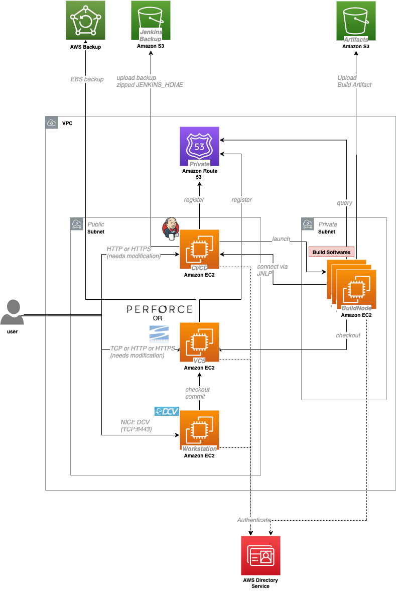

# Simple Game Studio on AWS

With this CDK application, you can easily build a simple and customizable game studio on AWS. The default setting covers a build farm, a source code repository, CI tool, workstation, and backups. If you are suffered from long build time, build farm management, slow response from CI tool, this project could help your time.



## Getting Started

### Prerequisites

- AWS Account, [AWS CLI v2](https://docs.aws.amazon.com/cli/latest/userguide/install-cliv2.html)
    - Preferably, **a dedicated AWS account for this project** since we can easily track costs
    - Setup your credential with `aws configure`
- [AWS CDK](https://docs.aws.amazon.com/cdk/latest/guide/getting_started.html#getting_started_prerequisites)
    - Install Node.js and CDK

### Pre-caution

By deploying this project into an AWS account, it will exceed Free Tier.
To avoid unnecessary charges, [clean up the environment](#clean-up) when you finish trying the project.

### Deployment (without customize)

CDK do the complex construction on behalf of you. You can customize what will be created by modifying `lib/gamestudio-stack.ts` and `bin/automated.ts`.

1. find out your global IP
    - CLI: `$ curl http://checkip.amazonaws.com/`
    - or, use your IP for your office network
1. `$ ALLOW_ACCESS_FROM=<YOUR_IP>/32 cdk deploy '*'` in the root directory.
1. Type `yes` for security questions, and wait to complete. You can also watch the progress in AWS Cloudformation console.
    1. Debug it by reading error messages if some problem occurred.
1. Configure services as you like. Guide for each service is [written below](#service-guide).

### Deployment (with customize)

Make changes to .ts files under `lib/stacks/`, modify `bin/` for your own stacks, and deploy it by `cdk deploy <YourStackName>`.
[Stack explanation](#stack) will help your understanding.

## <a id="service-guide"></a> Service Guides

### Jenkins

First of all, find a Jenkins endpoint in "EC2" -> "Instances" in AWS Console. "Name" looks like `Jenkins`.
Select it and you can see `IPv4 Public IP` or `Public DNS (IPv4)` in the lower pane.
You can access the given URL via a web browser.

To unlock Jenkins, you need to access the instance and obtain the password in `/var/lib/jenkins/secrets/initialAdminPassword`.
Do we need to SSH to the instance...? --- No! All you have to do is:

1. Select the instance (As described above), and click the "Connect" button, which is located right of the blue "Launch Instance" button
1. Choice "Session Manager", and press "Connect"
1. Then, type the command: `sudo cat /var/lib/jenkins/secrets/initialAdminPassword`
1. Copy the string, and paste it into the input box to unlock

It's easy! As you see, by attaching appropriate policy, you can access EC2 instances without SSH key.

Then, "Install suggested plugins", and create an administrator.
At `Instance Configuration` page, `Jenkins URL` must be `http://jenkins.gamestudio.aws.internal/` in order to connect correctly by build nodes.

After that, go to "Manage Jenkins" -> "Configure Global Security", and change some settings:

- "Agents" -> "TCP port for inbound agents" to `fixed: 50000`
- "CSRF Protection" -> check "Enable proxy compatibility"

Ignore "It appears that your reverse proxy set up is broken." messages on the top.

### Create Build Node AMI

You can easily create build nodes for heavy build tasks via [Launch Template](https://docs.aws.amazon.com/AWSEC2/latest/UserGuide/ec2-launch-templates.html).
First of all, you should create Amazon Machine Image (AMI), which is used as a base image for build nodes.

Open "EC2" -> "Launch Templates", and find a template named `build-machine-image-template`.
Select it, and "Launch instance from template" from "Actions ▼".

Launch with these settings:

- "Source template version": choose the latest one
- "Instance type": can be changed, if you would like to use another one
- "Key Pair": if you need to log in as Administrator, you have to specify this
- "Network settings": choose one subnet which is named as "PublicSubnet*"
- "Storage": can be changed, if you will run out of the disk space
- "Advanced details"
    - "User data": can be changed, if you would like to setup when 

Launch an instance, wait for minutes, and log into the instance with RDP.
You can login as `buildnode` with a password in AWS Secrets Manager (named as `buildnodeimageBuildNodeUser...`).
This user has administrative privileges.

Setup as you like, and then, launch `EC2Launch` in Windows and click "Shutdown with Sysprep".
Go back to EC2 Console, select the instance, click "Actions ▼" -> "Image" -> "Create image".
Type your wonderful "Image name", then click "Create Image".

After few minutes... Wow! You got an AMI for your build nodes!
You can see your AMI in "AMIs" menu.

### Launch Build Nodes

1. Open Jenkins
1. "Manage Jenkins" -> "New Node"
    - Name: amazing-name
    - Select "Permanent Agent"
1. In setting page:
    - Remote root directory: `C:\jenkins`
    - Labels: whatever-you-like (e.g. `ec2 windows ue4`)
1. Open the created agent page, note the **name** and **secrets**

Then, run an instance for a build node with the AMI (you have created the above section).
You have to connect Jenkins instance from a build node.
Of course, you can automate it.
Please see the sample script: `./docs/run-instance.sh`.

### (Example) UE4 Setup on Build Nodes

1. RDP into your instance
1. Download UE4 source (from Github, internal repository, or upload to S3 and download it)
1. Place UE4 files into `C:\UE4`
1. Setup build environments
1. Execute `C:\UE4\Setup.bat` and `C:\UE4\GenerateProjectFiles.bat`
1. Build the Engine (e.g. `call C:\UE4\Engine\Build\BatchFiles\Rebuild.bat -Target="ShaderCompileWorker Win64 Development" -Target="UE4Editor Win64 Development" -WaitMutex -FromMsBuild`)
1. Run `sysprep`, and make your build image (refer: https://aws.amazon.com/jp/premiumsupport/knowledge-center/sysprep-create-install-ec2-windows-amis/)

### Jenkins Jobs

If you have completed Jenkins setup, you can freely create your own Jenkins jobs. There are some samples:

- Backup
    - In this CDK script, `/usr/local/backup-jenkins.sh` has been created in the Jenkins instance. This script take JENKINS_HOME snapshot as a zip file and put it on a S3 bucket. You can create a Jenkins job which runs every 6 hours to make full backup periodically. Notice that you should delete unused backups to avoid unnecessary charges. [Amazon S3 Glacier](https://aws.amazon.com/glacier/) will help to keep full backups.
- Launch Build Instance Automatically
    - Create a parameterized job (powered by [Parameterized Trigger](https://plugins.jenkins.io/parameterized-trigger/)) with "Build Script" (`./docs/run-instance.sh`).
        - Create parameters (written as environment variables in the script)

### SimpleAD

SimpleAD is one of an Active Directory implementation in [AWS Directory Service](https://docs.aws.amazon.com/directoryservice/latest/admin-guide/directory_simple_ad.html).
It is easy-to-use Active Directory.
If you already have company-wide Active Directory, or need complex functionality, use another Active Directory instead of this SimpleAD.

In this script, all the instances in the created VPC can find SimpleAD via DNS.

### (Option) Join SimpleAD on Windows Servers

You can add your Windows server into SimpleAD directory by using the following command (replace placeholders).
In order not to expose `ADMIN_PASSWORD` to users, such steps should be done by AD administrator.

```powershell
$computer = Get-WmiObject -Class Win32_ComputerSystem
if ($computer.domain -eq 'WORKGROUP') {
  $domain = '<YOUR_FULL_QUALIFIED_DOMAIN>'
  $password = '<ADMIN_PASSWORD>' | ConvertTo-SecureString -asPlainText -Force
  $Administrator = '<NETBIOS_NAME>\Administrator'
  $credential = New-Object System.Management.Automation.PSCredential($Administrator,$password)
  Add-Computer -DomainName $domain -Credential $credential -restart
}
```

## <a id="stack"></a> Stack Explanation

There are some stacks to build your own game studio on AWS.
You can deploy with this command: `cdk deploy <STACK_NAME>` or if you would like to deploy all, use `cdk deploy '*'`.

These are pre-build stacks for demonstration.

- SetupStack - required for any other stack
    - The very first stack to deploy. This prepare some buckets, vpc, internal DNS, and backups.
- VCSStack
    - Creates VCS servers (currently a simple SVN server). 
    - after deploying, find your SVN password in AWS Secrets Manager
    - The SVN instance can be accessed by Systems Manager, Public IP, Private Ip, and `vcs.gamestudio.aws.internal` in the same VPC.
    - Backup: AWS Backup (EBS Snapshot, daily, 10-days retention)
- CICDStack
    - Creates Jenkins server
    - Access with SSM Start-sesison, and get a secret from `/var/lib/jenkins/secrets/initialAdminPassword`. Then, access the endpoint and setup your jenkins.
        - fix JNLP Agent port to `50000`
        - check "Configure Global Security" -> "CSRF Protection" -> "Enable proxy compatibility"
        - Jenkins URL: `http://jenkins.gamestudio.aws.internal/` for JNLP agent connectivity
    - Backup: manually create a Jenkins job to call `/usr/local/jenkins-backup.sh`. This script compress JENKINS_HOME and upload it to a S3 bucket which is created in `SetupStack`.
- BuildNodeImageStack
    - Creates an EC2 Instance for a template of build nodes
    - Access with RDP (user: `buildnode`, password is in the Secrets Manager), or you can set your keypair with modifiying this stack
    - Setup your build environment, such as UE4, Unity, and other game engines. After finishing construction, use [sysprep](https://aws.amazon.com/jp/premiumsupport/knowledge-center/sysprep-create-install-ec2-windows-amis/) and make your build machine image.
        - If you want to run "Integrated UE4 Build demo", UE4 Engine has to be placed at `C:\UE4\bin\UnrealEnging4.exe`, and Amazon Corretto installed
    - the default instance type is `c5.18xlarge`
- WorkstationStack
    - Creates a EC2 Launch Template for GPU workstation instances

## Tips

### Design for Failure

It is amazingly important to be ready for disaster in order not to break your studio and know the environment better.
Let's try these cases before you run this CDK in production.
Listed cases are very limited, so feel free to add your own cases!

- Shutdown Jenkins master server. How to restore the settings?
- Shutdown a workstation. How to restore the data?
- Change userdata in CDK and deploy it. How to debug it?
- Remove some of stacks. How to deploy it again?

### Update all the CDK dependencies

```bash
$ npm install -g aws-cdk  # Update CDK CLI
$ npm i -g npm-check-updates
$ ncu -u
$ npm i
```

`cdk diff` tells you if there are breaking changes.

### <a id="clean-up"></a> Clean up

`$ cdk destroy` is the fastest method to clean up.
A common error to prevent deletion is `X has dependencies`.
If you see this kind of message, read error messages and delete resources manually before running `destroy` command again.
You can also delete stacks in AWS Cloudformation console.

Even after destroying, S3 buckets, keys, some EBSs are not deleted (`status: DELETE_SKIPPED` in CloudFormation console) to prevent backups deleted.
You can manually delete it if you are just trying this repository.
Using AWS CLI is a good idea to delete multiple buckets.
(e.g. `$ aws s3 ls | cut -d" " -f 3 | grep  '^setupstack-*' | xargs -I{} aws s3 rb s3://{}`. appending `--force` will delete all the contents in found buckets. Be careful!)

## Security

See [CONTRIBUTING](CONTRIBUTING.md#security-issue-notifications) for more information.

## License

This library is licensed under the MIT-0 License. See the LICENSE file.
